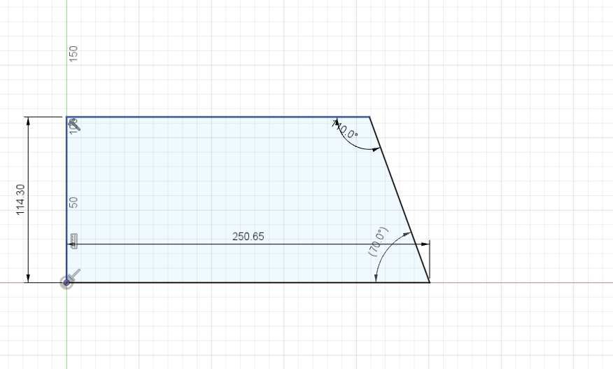
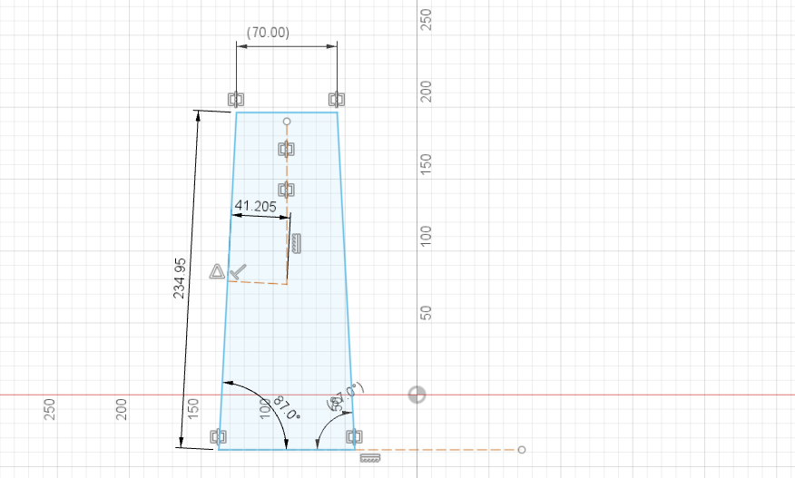
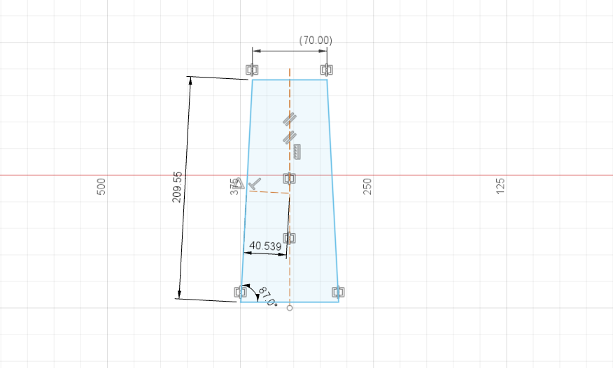
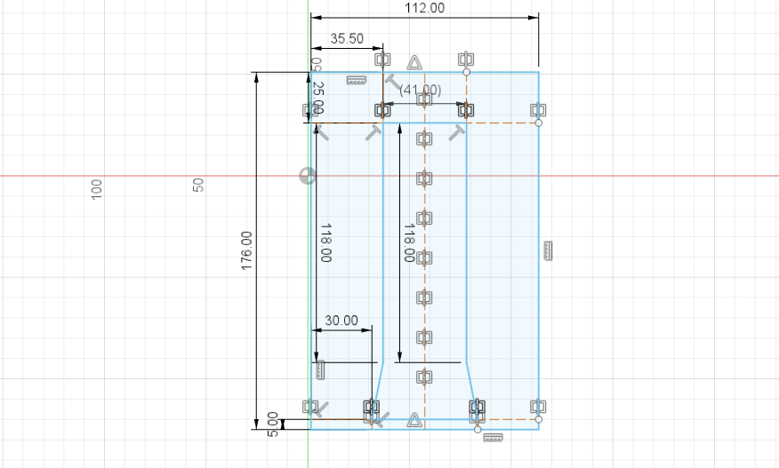
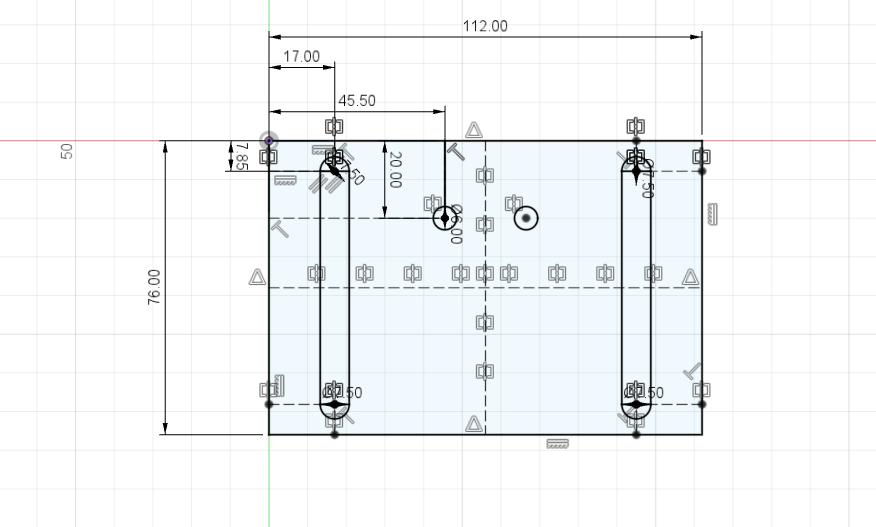
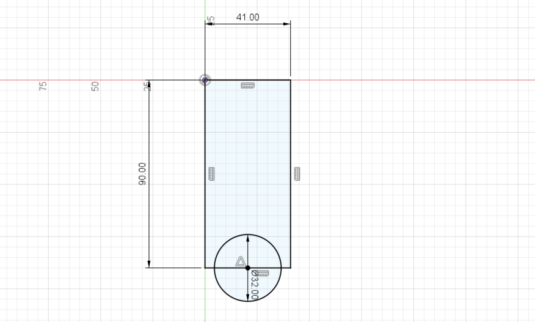
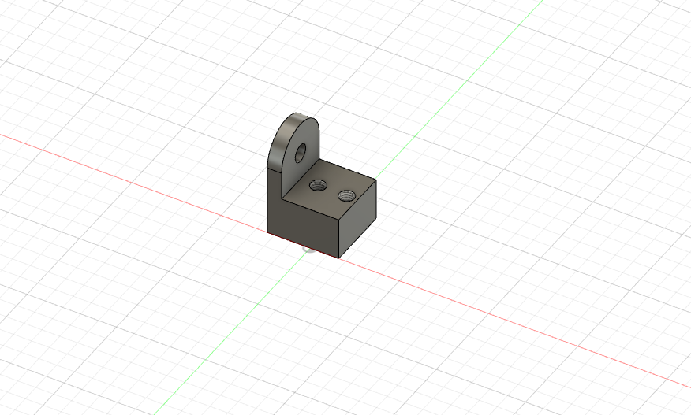

# Rodent restraint box 

#### By Josh Wilson 

#### Original design by Dr. Donald Katz 

## Design goals 

To be able consistently and accurately assess rodent behavior it is at times necessary to minimize their movement options and have them focus on a given task. This is done by surgically placing a post onto a rodents crainum which would be able to interface with a hole on the face of the box itself. This box, similarly to the response port manifold, was made in response to a specific experimental need and can be adjusted to fit the needs of other types of experiments. 

## Design parameters

**Tools**

The different parts of the restraint box were designed in fusion 360 to either be later 3D printed using a MKII prusa or laser cut out of 3/4'' acrylic using a Universal Laser Systems laser cutter. 

**step by step**

1. The first step to creating the restraint box is designing the box itself, this was done in six different increments. The first part created was the sides of the box, which was made of a canted rectangle. The parameters of the rectangle were 114.3x250.65mm, with two of the corners being 140 and 170 degrees 

   

   

2. The next step was to create the floor of the box, which was also made of a canted rectangle. The rectangle was 70x234.95mm with two parallel corners with 87 degree angles 

   

   

3. Next, the top was created using an identical process to make the floor, the top was 70x209.55mm. 

   

   

4. Next, the face of the box was created using a a rectangle and had the space where the post-interface would sit. The face is 112x176mm, the space where the post-interface would sit is 41x118mm with a slight orthogonal region toward the bottom. There were also 6mm diameter holes placed 17.3 from the side and  66.25mm from the top of the face itself. These holes were used to hold thumbscrews which held the post-interface section in a given place.

   

   

5. After creating the face, the next step was to create the post-interface that would sit in the face. This part is split into three separate parts, the plate, the post-holder, and the post. The plate is where the thumb screws go through to hold down the rest of the plate and the plate itself can shift up and down to change the height of the post and post holder. The plate was made using a 112x76mm rectangle, the space that the thumbscrews would go was made using a slot with a 7.5mm diameter circle. There was also two 6mm circles placed near the center of the plate to be able to screw on the post holder. 

   

   

6. The post holder serves two purposes, the first and most obvious is that it holds the post the connects to the post that is on a rodents head, second is that it operates as a sort of boundary around the animals head minimizing movement. The body of the holder was made from a 41x90mm rectangle and  a 32mm circle on one end served as the whole were the animal's head would go. Then two sets of 6mm diameter holes were placed near the top and where head hole. The holes near the top were used to screw the post-holder to the plate and the holes near the head hole were used to screw the post. 

   

   

7. The last piece the needed to be made was the post. The post was made starting with a 16x16mm cube that was extruded to be 12mm tall. Then two 3mm holes were placed 8mm apart and 5 mm from a given side. Then on one side a 20x18 rectangle was sketched and had to cocentric circles placed at the midpoint of the 18mm side. The inner circle was 5mm in diameter and the outer circle was a 6.5mm offset from the inner circle. This sketch was then extruded 4mm. 

   

   
   
    

### Manufacturing 

To complete the assembly on the rodent restraint box the pieces from steps 1-6 were converted to svg files using the origin script that can be found within fusion 360. The pieces were cut out of 3/4" acrylic and the post was 3D printed. The sides, top, bottom, and face were then super glued together and the front plate, post holder, and post were then screw together using their respective screw holes. 